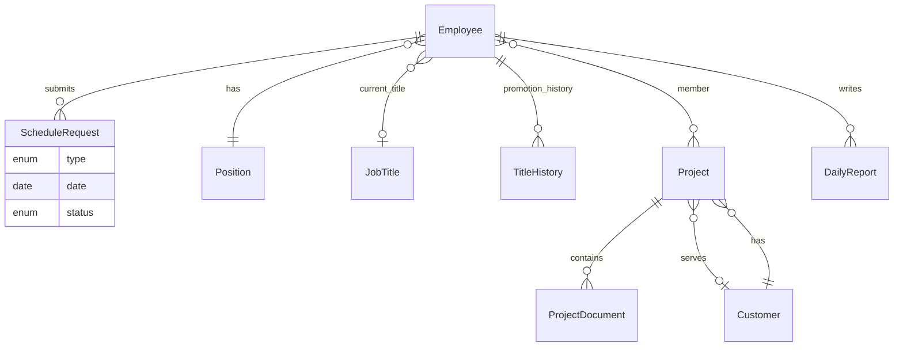

# REQUIREMENTS — Ứng dụng web quản lý nhân sự (phía người quản lý)

## 1. Phạm vi và vai trò

- **Phạm vi**: Chỉ mô tả chức năng dành cho **người quản lý / quản trị** (Manager/Admin). Không mô tả màn hình nhân viên trừ phần cần thiết để hiểu nguồn dữ liệu (nhân viên gửi yêu cầu, gửi daily).
- **Vai trò**: `QuanTriVien` hoặc `QuanLy` với quyền truy cập các module dưới đây. Có thể tách chi tiết HR/PM ở giai đoạn thiết kế phân quyền.

## 2. Thuật ngữ

- **Nhân viên**: người được quản lý trong hệ thống.
- **Vị trí (Position)**: vai trò công việc (ví dụ Backend Developer), danh mục CRUD độc lập.
- **Chức vụ (Job title / cấp bậc)**: cấp trong cơ cấu nhân sự, có **lịch sử thăng tiến**.
- **Dự án**: đơn vị công việc có thành viên, tài liệu, khách hàng (nếu gắn), doanh thu.
- **Lịch làm việc cố định**: một trong hai lựa chọn `8:00–17:00` (8-5) hoặc `9:00–18:00` (9-6).
- **Yêu cầu lịch**: nghỉ/remote theo buổi hoặc cả ngày; yêu cầu đổi lịch cố định giữa hai template trên.

## 3. Yêu cầu chức năng

### 3.1. Quản lý danh sách nhân viên

| ID | Mô tả |
|----|--------|
| FR-1.1 | Danh sách nhân viên có tìm kiếm/lọc theo phòng ban, dự án, vị trí, chức vụ. |
| FR-1.2 | Thuộc tính tối thiểu: **Họ tên**, **Ngày sinh (DOB)**, **Nơi ở**, **Vị trí** (tham chiếu Position), **Phòng ban**, **Dự án** (một hoặc nhiều — đồng bộ với module dự án), **Lịch làm việc cố định**: chỉ `8-5` hoặc `9-6`. |
| FR-1.3 | Thêm nhân viên; xóa hoặc **ngưng sử dụng** (soft delete). Không xóa cứng khi còn ràng buộc dữ liệu — chặn hoặc soft delete kèm thông báo. |
| FR-1.4 | **Xem chi tiết** nhân viên: đủ thuộc tính và metadata (ngày tạo, người cập nhật cuối). |
| FR-1.5 | **Sửa / cập nhật** thông tin; validate DOB và trường bắt buộc; ghi log thay đổi (khuyến nghị). |

**Tiêu chí chấp nhận**: Tạo và cập nhật nhân viên thành công; danh sách phản ánh thay đổi; lịch cố định chỉ hai giá trị hợp lệ.

### 3.2. Quản lý lịch làm việc và yêu cầu

Loại yêu cầu (nhân viên gửi — quản lý xử lý):

- Nghỉ cả ngày
- Remote cả ngày
- Nghỉ buổi sáng / chiều
- Remote buổi sáng / chiều

| ID | Mô tả |
|----|--------|
| FR-2.1 | Bảng/lịch theo **ngày** (khoảng thời gian do người dùng chọn): mỗi ngày hiển thị **số lượng** theo trạng thái (off, remote, nửa buổi tương ứng). Có thể gom nhóm hiển thị nếu cần gọn UI. |
| FR-2.2 | **Drill-down**: chỉ khi **nhấn vào** ô ngày hoặc chỉ số mới hiển thị **danh sách nhân viên** theo từng loại. |
| FR-2.3 | Hàng đợi yêu cầu trạng thái Chờ duyệt; lọc theo loại, nhân viên, ngày. |
| FR-2.4 | **Phê duyệt** nghỉ/remote/…: **Duyệt** / **Từ chối** (lý do bắt buộc khi từ chối); sau duyệt, dữ liệu hiển thị đúng trên lịch tổng hợp. |
| FR-2.5 | **Phê duyệt đổi lịch cố định** (8-5 ↔ 9-6): duyệt/từ chối; khi duyệt, cập nhật lịch cố định trên hồ sơ nhân viên. |

**Quy tắc nghiệp vụ gợi ý**: Trùng lặp request cùng ngày cần quy tổ chức (một bản chờ duyệt, hoặc quy tắc ghi đè). Cảnh báo khi kết hợp nửa ngày không hợp lý (ví dụ trùng buổi).

**Tiêu chí chấp nhận**: Số đếm theo ngày đúng; drill-down đúng danh sách; phê duyệt cập nhật trạng thái và dữ liệu nhân viên khi đổi lịch cố định.

### 3.3. Báo cáo tiến độ (Daily)

| ID | Mô tả |
|----|--------|
| FR-3.1 | Mỗi ngày, mỗi nhân viên có bản ghi daily gồm: **Ngày**, **Nội dung công việc**, **Dự án**, **Task** (text hoặc tham chiếu task sau này). |
| FR-3.2 | Quản lý **xem theo nhân viên**: chọn nhân viên → danh sách daily **theo từng ngày** (bảng hoặc timeline). |
| FR-3.3 | Lọc theo khoảng ngày và theo dự án. |

**Tiêu chí chấp nhận**: Dữ liệu đúng map nhân viên–ngày–dự án–task; khi lọc một nhân viên không lộ dữ liệu nhân viên khác.

### 3.4. Quản lý dự án

| ID | Mô tả |
|----|--------|
| FR-4.1 | Danh sách dự án: CRUD; trạng thái dự án (ví dụ Đang chạy / Tạm dừng / Kết thúc). |
| FR-4.2 | **Thành viên**: gán/gỡ nhân viên; tùy chọn vai trò trong dự án. |
| FR-4.3 | **Lịch sử tiến độ theo ngày**: xem daily (hoặc báo cáo tiến độ) của từng thành viên, lọc theo thành viên và ngày. |
| FR-4.4 | **Tài liệu dự án**: tải lên, danh sách, tải xuống, xóa (theo quyền); metadata: tên, ngày, người tải. |
| FR-4.5 | **Thông tin khách hàng** liên quan dự án (chi tiết mục 3.4.1). |
| FR-4.6 | **Doanh thu dự án**: nhập/sửa số liệu (số tiền, kỳ, phân loại dự kiến/thực tế — cố định schema khi triển khai). |

#### 3.4.1. Quản lý thông tin khách hàng

Trường đề xuất:

- Tên công ty (bắt buộc)
- Mã số thuế / mã khách hàng nội bộ
- Địa chỉ đăng ký kinh doanh; địa chỉ liên hệ (nếu khác)
- Quốc gia; tỉnh/thành
- Người liên hệ chính: họ tên, chức vụ, email, điện thoại
- Phương thức / điều khoản thanh toán
- Ghi chú; trạng thái hợp tác (hoạt động, tạm ngưng, …)
- **Liên kết với dự án**: quy tắc 1-n hoặc n-n — quyết định khi thiết kế CSDL

**Tiêu chí chấp nhận**: CRUD khách hàng; hiển thị trong chi tiết dự án; gán dự án ↔ khách hàng nhất quán.

### 3.5. Quản lý vị trí (Position)

| ID | Mô tả |
|----|--------|
| FR-5.1 | CRUD Position: tên, mô tả (tùy chọn), trạng thái. |
| FR-5.2 | Hạn chế xóa Position đang gán cho nhân viên hoặc bắt buộc đổi vị trí trước. |
| FR-5.3 | **Cập nhật vị trí nhân viên** từ hồ sơ nhân viên hoặc thao tác hàng loạt; ghi nhật ký thay đổi (khuyến nghị). |

### 3.6. Quản lý chức vụ và thăng tiến

| ID | Mô tả |
|----|--------|
| FR-6.1 | CRUD chức vụ: tên, **thứ tự cấp** (để sắp xếp và quy tắc promote), mô tả. |
| FR-6.2 | **Promote**: chọn nhân viên, chức vụ mới, ngày hiệu lực, ghi chú; tùy chọn chỉ cho phép lên cấp theo `thứ tự cấp`. |
| FR-6.3 | **Lịch sử thăng tiến**: chức vụ cũ → mới, ngày, người thực hiện, lý do/ghi chú. |
| FR-6.4 | **Timeline**: hiển thị lịch sử thăng tiến theo trục thời gian trên chi tiết nhân viên. |

## 4. Yêu cầu phi chức năng (gợi ý)

- **Bảo mật**: xác thực; chỉ người có quyền quản lý truy cập module; nhật ký hành động nhạy cảm (phê duyệt, thay chức vụ).
- **Hiệu năng**: phân trang danh sách nhân viên và drill-down theo ngày.
- **Audit**: lưu người duyệt, thời điểm duyệt/từ chối.

## 5. Mô hình dữ liệu gợi ý (ER)

## 6. Phiên bản tài liệu

| Phiên bản | Ngày | Ghi chú |
|-----------|------|---------|
| 1.0 | — | Bản đầu: phạm vi quản lý |
