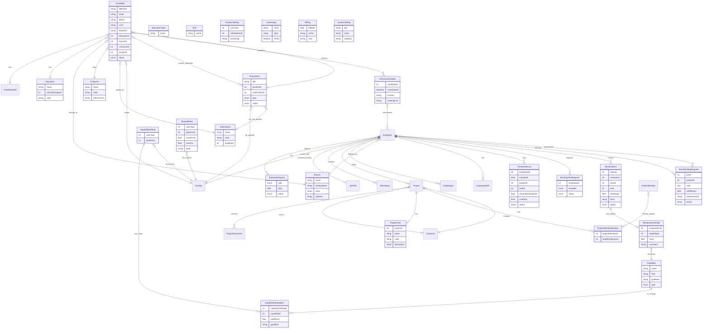

# TÀI LIỆU SPEC — CÁC TÍNH NĂNG BỔ SUNG TỪ NCC TALENT & NCC TIMESHEET

> Mục đích: Bổ sung các tính năng còn thiếu từ 2 hệ thống NCC TALENT và NCC Timesheet vào hệ thống quản lý nhân sự hiện tại.
> Baseline: `docs/project.md` (FR-1..FR-6) + `docs/system-analysis-design.md`

---

## TÓM TẮT PHẠM VI BỔ SUNG

| STT | Module | Nguồn | Mức độ ưu tiên |
|-----|--------|-------|----------------|
| 1 | Master Data (Education, Skill, CV Source, Branch) | NCC TALENT | Cao |
| 2 | Recruitment & Candidate Management | NCC TALENT | Cao |
| 3 | Timesheet Detail (log, submit, lock, complain) | NCC Timesheet | Cao |
| 4 | Request Expansion (Onsite, Team Building) | NCC Timesheet | Trung bình |
| 5 | Review Intern & Capability Assessment | NCC Timesheet | Cao |
| 6 | Working Time Registration | NCC Timesheet | Trung bình |
| 7 | System Configuration & Settings | NCC Timesheet | Trung bình |
| 8 | Project Expansion (Task, Shadow) | NCC Timesheet | Trung bình |
| 9 | Reports (Tardiness, Overtime, Recruitment Overview) | Cả hai | Trung bình |

---

## 1. MASTER DATA MODULE (Mở rộng từ NCC TALENT)

### 1.1 Education Type — FR-7.1
| ID | Mô tả |
|----|-------|
| FR-7.1.1 | CRUD Education Type: `name` (bắt buộc, unique). |
| FR-7.1.2 | Hạn chế xóa nếu đang được tham chiếu bởi Education. |

### 1.2 Education — FR-7.2
| ID | Mô tả |
|----|-------|
| FR-7.2.1 | CRUD Education: `name`, `educationTypeId` (FK), `color` (hex, tùy chọn). |
| FR-7.2.2 | Cho phép tạo Education Type trực tiếp từ màn hình Education (inline create). |
| FR-7.2.3 | Hạn chế xóa nếu đang được tham chiếu bởi Candidate/Employee. |

### 1.3 Skill — FR-7.3
| ID | Mô tả |
|----|-------|
| FR-7.3.1 | CRUD Skill: `name` (bắt buộc, unique). |
| FR-7.3.2 | Hạn chế xóa nếu đang được tham chiếu bởi Candidate/Employee. |

### 1.4 CV Source — FR-7.4
| ID | Mô tả |
|----|-------|
| FR-7.4.1 | CRUD CV Source: `name`, `color` (hex), `referenceTo` (text/link, tùy chọn). |
| FR-7.4.2 | Dùng để tracking nguồn ứng viên (Staff Source, Intern Source report). |

### 1.5 Branch — FR-7.5
| ID | Mô tả |
|----|-------|
| FR-7.5.1 | CRUD Branch: `name` (unique), `displayName`, `color` (hex), `address`. |
| FR-7.5.2 | Branch liên kết với các module khác qua `name` hoặc `code` (Timesheet, HRM, LMS). |
| FR-7.5.3 | Mỗi nhân viên thuộc về đúng 1 Branch tại 1 thời điểm. |

### 1.6 Sub Position — FR-7.6
| ID | Mô tả |
|----|-------|
| FR-7.6.1 | CRUD Sub Position: `name`, `color` (hex), `positionId` (FK đến Position hiện tại). |
| FR-7.6.2 | Sub Position liên kết với LMS để tạo bài test. |
| FR-7.6.3 | Hạn chế xóa nếu đang được tham chiếu bởi Candidate hoặc Position Setting. |

---

## 2. CAPABILITY & ASSESSMENT MODULE (NCC TALENT + Timesheet)

### 2.1 Capability — FR-8.1
| ID | Mô tả |
|----|-------|
| FR-8.1.1 | CRUD Capability: `name`, `from` (source/nguồn), `guideline` (hướng dẫn đánh giá). |
| FR-8.1.2 | Mỗi Capability có thể là loại `POINT` (điểm số) hoặc `TEXT` (nhận xét). |
| FR-8.1.3 | Hạn chế xóa nếu đã được thêm vào Capability Setting. |

### 2.2 Capability Setting — FR-8.2
| ID | Mô tả |
|----|-------|
| FR-8.2.1 | CRUD Capability Setting: gắn các Capability vào từng tổ hợp `userType` + `positionId`. |
| FR-8.2.2 | Mỗi setting bắt buộc có ít nhất 1 Capability được chọn. |
| FR-8.2.3 | Có thể điều chỉnh `coefficient` (hệ số nhân) và `guideline` riêng cho từng Capability trong setting. |
| FR-8.2.4 | Clone Capability Setting sang tổ hợp `userType` + `positionId` khác (không cho clone nếu đã tồn tại). |
| FR-8.2.5 | Chỉnh sửa: thêm/bớt Capability từ danh sách Available sang Selected. |

### 2.3 Score Setting — FR-8.3
| ID | Mô tả |
|----|-------|
| FR-8.3.1 | CRUD Score Setting: `userType`, `positionId`, `scoreFrom`, `scoreTo`, `level` (bậc thang điểm). |
| FR-8.3.2 | Dùng để mapping tổng điểm review sang level tương ứng. |
| FR-8.3.3 | Validate `scoreFrom` < `scoreTo` và không overlap giữa các khoảng cùng `userType` + `positionId`. |

### 2.4 Position Setting — FR-8.4
| ID | Mô tả |
|----|-------|
| FR-8.4.1 | CRUD Position Setting: gắn `userType` + `subPositionId`. |
| FR-8.4.2 | Liên kết với LMS: khi tạo account ứng viên mới, cần thông tin từ Position Setting để tạo bài test đúng. |

---

## 3. RECRUITMENT & CANDIDATE MODULE (NCC TALENT)

### 3.1 Candidate (Staff List / Intern List) — FR-9.1
| ID | Mô tả |
|----|-------|
| FR-9.1.1 | CRUD Candidate: đầy đủ thông tin cá nhân, `cvUrl` (upload file), `avatarUrl`, `educationId`, `skills` (mảng FK), `branchId`, `cvSourceId`. |
| FR-9.1.2 | `assignTo` (người phụ trách/HR hoặc Recruiter). |
| FR-9.1.3 | `status` theo workflow tuyển dụng. |
| FR-9.1.4 | Tải xuống CV từng ứng viên. |
| FR-9.1.5 | Export danh sách candidate theo bộ lọc (time, branch, status). |
| FR-9.1.6 | Clone candidate (tạo bản sao hoàn toàn như ứng viên mới). |

### 3.2 Candidate Status Workflow — FR-9.2
| Trạng thái | Mô tả |
|------------|-------|
| `New` | Ứng viên mới nhập |
| `ScheduledTest` | Lên lịch làm bài test |
| `FailedTest` / `RejectedTest` | Trượt/từ chối test |
| `ScheduledInterview` | Lên lịch phỏng vấn |
| `PassedInterview` / `FailedInterview` | Đạt/trượt phỏng vấn |
| `AcceptedOffer` / `RejectedOffer` | Nhận/từ chối offer |
| `Onboarded` | Đã onboard |
| `RejectedApply` | Từ chối đơn ứng tuyển |

Quy tắc chuyển trạng thái:
- Từ `New` → `ScheduledTest`: tạo account LMS để làm bài test, gửi mail.
- Từ `ScheduledTest` → `ScheduledInterview`: chọn thời gian và người phỏng vấn, gửi mail.
- Chỉ status `Pass` mới được chọn Current Requisition.

### 3.3 Current Requisition — FR-9.3
| ID | Mô tả |
|----|-------|
| FR-9.3.1 | Gán Candidate vào 1 Requisition cụ thể. |
| FR-9.3.2 | Có thể clone, sửa, xóa, đóng Requisition trực tiếp từ màn hình ứng viên. |
| FR-9.3.3 | Thay đổi Current Requisition của ứng viên. |

### 3.4 Requisition (Staff / Intern) — FR-9.4
| ID | Mô tả |
|----|-------|
| FR-9.4.1 | CRUD Requisition: thông tin yêu cầu tuyển dụng. |
| FR-9.4.2 | Add CV (gán candidate vào requisition). |
| FR-9.4.3 | Edit, Clone, Close, Delete requisition. |
| FR-9.4.4 | Điều kiện Close: tất cả candidate trong requisition phải có status thuộc {FailedTest, FailedInterview, RejectedInterview, RejectedOffer, Onboarded, RejectedTest, RejectedApply}. |

### 3.5 Interview Management — FR-9.5
| ID | Mô tả |
|----|-------|
| FR-9.5.1 | Candidate Interview List: lọc candidate có status `PassedInterview`, `ScheduledInterview`, `FailedInterview`. |
| FR-9.5.2 | Lên lịch phỏng vấn: chọn thời gian, người phỏng vấn (interviewerIds). |
| FR-9.5.3 | Gửi mail thông báo phỏng vấn cho ứng viên. |

### 3.6 Candidate Offer & Onboard — FR-9.6
| ID | Mô tả |
|----|-------|
| FR-9.6.1 | Candidate Offer List: lọc candidate có status `AcceptedOffer`, `RejectedOffer`, `FailedInterview`. |
| FR-9.6.2 | Candidate Onboard List: lọc candidate có status `AcceptedOffer`, `RejectedOffer`, `Onboarded`. |
| FR-9.6.3 | Khi onboard, tự động tạo Employee record từ Candidate (hoặc thủ công). |

### 3.7 Recruitment Overview — FR-9.7
| ID | Mô tả |
|----|-------|
| FR-9.7.1 | Dashboard tổng quan tuyển dụng: tổng theo từng cột (trạng thái, nguồn, vị trí). |
| FR-9.7.2 | Staff Source / Intern Source: biểu đồ thống kê nguồn ứng viên theo khoảng thời gian đã chọn. |
| FR-9.7.3 | Intern Education: thống kê education của intern theo time + branch, có export. |
| FR-9.7.4 | Export CV Score (tổng hợp điểm đánh giá CV/test). |

---

## 4. TIMESHEET DETAIL MODULE (NCC Timesheet)

> Lưu ý: Hệ thống hiện tại đã có Schedule Request (FR-2.x) và Daily Report (FR-3.x). Module này bổ sung thêm tính năng log/submit/approve timesheet chi tiết theo task.

### 4.1 Timesheet Entry — FR-10.1
| ID | Mô tả |
|----|-------|
| FR-10.1.1 | Nhân viên log timesheet theo ngày: chọn project, task, nhập số giờ `normalWorkingTime`, `overtime` (tùy chọn). |
| FR-10.1.2 | Tổng `normalWorkingTime` trong 1 ngày không thể > 8 giờ. |
| FR-10.1.3 | Nếu đã log off (approved schedule request) thì `normalWorkingTime` + số giờ off không thể > 8h. |
| FR-10.1.4 | Không thể log normal working time vào ngày nghỉ/ngày lễ. |
| FR-10.1.5 | Tổng thời gian log timesheet của 1 ngày không > 24h. |
| FR-10.1.6 | Có thể chỉnh sửa/xóa timesheet, nhưng một khi đã được PM approve thì không thể thực hiện action nào. |
| FR-10.1.7 | Nhân viên remote phải log timesheet hàng ngày. |

### 4.2 Timesheet Submit — FR-10.2
| ID | Mô tả |
|----|-------|
| FR-10.2.1 | Nhân viên submit timesheet của tuần/tháng để PM approve. |
| FR-10.2.2 | Trạng thái timesheet: `DRAFT` → `PENDING` → `APPROVED` / `REJECTED`. |
| FR-10.2.3 | Timesheet phải được log trước ngày cuối cùng của tuần/tháng, sang tuần/tháng mới sẽ tự động khóa. |

### 4.3 Timesheet Complain — FR-10.3
| ID | Mô tả |
|----|-------|
| FR-10.3.1 | Nhân viên gửi complain cho timesheet đã log: nhập comment, đánh dấu xác nhận. |
| FR-10.3.2 | PM hoặc Admin nhận complain và xử lý. |

### 4.4 PM Approve/Reject Timesheet — FR-10.4
| ID | Mô tả |
|----|-------|
| FR-10.4.1 | PM xem danh sách timesheet ở trạng thái `PENDING` của team mình quản lý. |
| FR-10.4.2 | PM có thể Approve hoặc Reject (kèm lý do) từng timesheet hoặc hàng loạt. |
| FR-10.4.3 | Sau khi approve/reject, nhân viên không thể chỉnh sửa timesheet đó. |

### 4.5 Auto Lock Timesheet — FR-10.5
| ID | Mô tả |
|----|-------|
| FR-10.5.1 | Tự động khóa timesheet của tuần/tháng cũ khi sang tuần/tháng mới. |
| FR-10.5.2 | Cấu hình ngày khóa timesheet tháng trước (`lockDayOfMonth`). |
| FR-10.5.3 | Cấu hình số tuần cho phép unlock timesheet (`unlockWeeks`). |

### 4.6 Timesheet Monitoring — FR-10.6
| ID | Mô tả |
|----|-------|
| FR-10.6.1 | Dashboard tổng quan timesheet toàn công ty: tổng giờ làm, dự án theo tuần/tháng/quý. |
| FR-10.6.2 | Có thể drill-down theo phòng ban, dự án, nhân viên. |

---

## 5. REQUEST EXPANSION MODULE (NCC Timesheet)

> Mở rộng từ Schedule Request hiện tại (FR-2.x).

### 5.1 Onsite Request — FR-11.1
| ID | Mô tả |
|----|-------|
| FR-11.1.1 | Nhân viên gửi request onsite: chọn ngày, buổi (full day / morning / afternoon / số giờ), nhập lý do. |
| FR-11.1.2 | Quy tắc giống off/remote hiện tại: không log vào quá khứ, ngày nghỉ, lễ; tổng giờ không > 8h. |
| FR-11.1.3 | PM/Manager duyệt/từ chối. |

### 5.2 Team Building Request — FR-11.2
| ID | Mô tả |
|----|-------|
| FR-11.2.1 | PM tạo request team building: chọn user (trong project hoặc thêm user ngoài project), nhập lý do, upload file (jpg, jpeg, png, pdf, docx, doc). |
| FR-11.2.2 | Tính `totalMoney` theo số lượng user được chọn (so sánh với tổng tiền trên hóa đơn). |
| FR-11.2.3 | HR duyệt/từ chối request. |
| FR-11.2.4 | Xem request history, view detail, cancel (chỉ cancel khi status = `PENDING`). |

---

## 6. WORKING TIME MODULE (NCC Timesheet)

### 6.1 Register Working Time — FR-12.1
| ID | Mô tả |
|----|-------|
| FR-12.1.1 | Nhân viên đăng ký lịch làm việc: 2 template — `8:30-12:00 & 13:00-17:30` hoặc `9:00-12:00 & 13:00-18:00`. |
| FR-12.1.2 | Gửi request cho PM để phê duyệt. |
| FR-12.1.3 | Trạng thái: `PENDING` → `APPROVED` / `REJECTED`. |

### 6.2 Manage Working Time — FR-12.2
| ID | Mô tả |
|----|-------|
| FR-12.2.1 | PM/Manager xem danh sách đăng ký lịch làm việc của team. |
| FR-12.2.2 | PM có thể Approve/Reject từng request. |

---

## 7. REVIEW INTERN MODULE (NCC Timesheet)

### 7.1 Review Intern Period — FR-13.1
| ID | Mô tả |
|----|-------|
| FR-13.1.1 | Tạo review theo tháng: chọn tháng, hệ thống liệt kê các intern trong team PM. |
| FR-13.1.2 | PM nhập điểm/nhận xét theo từng tiêu chí trong Capability Setting tương ứng với `userType` + `position` của intern. |
| FR-13.1.3 | Tiêu chí loại `POINT`: nhập điểm, hệ thống tính theo `coefficient`. |
| FR-13.1.4 | Tiêu chí loại `TEXT`: nhập nhận xét. |
| FR-13.1.5 | Tổng điểm được mapping sang `level` dựa vào Score Setting. |
| FR-13.1.6 | PM chỉ review được intern của team mình quản lý. |

### 7.2 Review Workflow — FR-13.2
| ID | Mô tả |
|----|-------|
| FR-13.2.1 | Trạng thái review: `DRAFT` → `REVIEWED` (bởi PM) → `APPROVED` (bởi HR/Admin) → `REJECTED`. |
| FR-13.2.2 | Sau khi PM review xong, HR/Admin có thể Approve all / Reject. |
| FR-13.2.3 | Sau khi approved, có thể Send email thông báo kết quả review. |
| FR-13.2.4 | Sau khi send email, có thể Update to HRM (đồng bộ thông tin lên HRM). |

### 7.3 Review Intern Settings — FR-13.3
| ID | Mô tả |
|----|-------|
| FR-13.3.1 | `Percent Salary Probationary`: default = 85% khi chốt lương intern lên chính thức. |
| FR-13.3.2 | `User Level Setting`: cài đặt mức lương tương ứng với từng level. |
| FR-13.3.3 | `Notify Review Intern Setting`: gửi thông báo nhắc nhở PM review intern định kỳ. |

### 7.4 Review Report — FR-13.4
| ID | Mô tả |
|----|-------|
| FR-13.4.1 | View report: xem toàn bộ intern và quá trình review theo tháng. |
| FR-13.4.2 | Search intern, export báo cáo. |

---

## 8. PROJECT EXPANSION MODULE (NCC Timesheet)

### 8.1 Project Task — FR-14.1
| ID | Mô tả |
|----|-------|
| FR-14.1.1 | CRUD Task trong phạm vi project: `name`, `code`, `description`, `projectId` (FK). |
| FR-14.1.2 | Task dùng để nhân viên log timesheet chi tiết. |
| FR-14.1.3 | Special Project Task Setting: cấu hình project/task mặc định (ví dụ: Opentalk). |

### 8.2 Shadow Member — FR-14.2
| ID | Mô tả |
|----|-------|
| FR-14.2.1 | Trong project, PM có thể đánh dấu member là `type = SHADOW`. |
| FR-14.2.2 | Shadow member có thể shadow cho nhiều bill account (targetUsers). |
| FR-14.2.3 | Ngược lại, 1 bill account có thể được shadow bởi nhiều người. |
| FR-14.2.4 | Khi log timesheet, shadow member log task thực tế và task bill cho account được shadow. |

### 8.3 Export Timesheet Detail — FR-14.3
| ID | Mô tả |
|----|-------|
| FR-14.3.1 | PM export timesheet detail của project ra file (Excel/PDF). |
| FR-14.3.2 | Bao gồm: ngày, nhân viên, task, số giờ, loại (normal/overtime/shadow). |

---

## 9. SYSTEM CONFIGURATION MODULE (NCC Timesheet)

### 9.1 General Settings — FR-15.1
| ID | Mô tả |
|----|-------|
| FR-15.1.1 | **Email Setting**: cấu hình SMTP/server gửi mail. |
| FR-15.1.2 | **Notification Setting (Komu/Discord)**: cấu hình webhook gửi noti. |
| FR-15.1.3 | **Google SSO Setting**: bật/tắt đăng nhập bằng Google. |
| FR-15.1.4 | **Working Time Setting**: cài đặt địa chỉ mail HR, template giờ làm việc mặc định. |

### 9.2 Timesheet Settings — FR-15.2
| ID | Mô tả |
|----|-------|
| FR-15.2.1 | **Log Timesheet Setting**: cho phép log tương lai, số ngày cho phép log (`allowedDays`), ngày khóa timesheet tháng trước (`lockDay`), max giờ/ngày (`maxHoursPerDay`). |
| FR-15.2.2 | **Auto Submit Timesheet**: tự động submit timesheet cho user đến thời điểm cấu hình. |
| FR-15.2.3 | **Auto Lock Timesheet Setting**: cấu hình tự động khóa timesheet. |
| FR-15.2.4 | **Unlock Timesheet Setting**: số tuần user có thể unlock timesheet sau khi bị khóa. |

### 9.3 Integration Settings — FR-15.3
| ID | Mô tả |
|----|-------|
| FR-15.3.1 | **Get Data from FaceID Setting**: cấu hình lấy dữ liệu check in/out từ FaceID. |
| FR-15.3.2 | **HRM Setting**: cấu hình API integration với HRM. |
| FR-15.3.3 | **Project Setting**: cấu hình API integration với Project tool. |

### 9.4 Request Settings — FR-15.4
| ID | Mô tả |
|----|-------|
| FR-15.4.1 | **Max Remote Day Allow**: số ngày remote tối đa/tuần. |
| FR-15.4.2 | **Allow Intern Remote**: checkbox cho phép intern remote. |
| FR-15.4.3 | **Max Total Tardiness and Early Leave**: tổng số giờ tối đa request đi muộn/về sớm. |

### 9.5 Leave Types & Off Days — FR-15.5
| ID | Mô tả |
|----|-------|
| FR-15.5.1 | CRUD Leave Type: `name`, `color`, `isPaid` (có lương hay không). |
| FR-15.5.2 | CRUD Off Day: đánh dấu ngày nghỉ công ty, ngày lễ (`date`, `name`, `note`). |
| FR-15.5.3 | Off day dùng để validate không cho log timesheet normal working. |

### 9.6 Punishment Settings — FR-15.6
| ID | Mô tả |
|----|-------|
| FR-15.6.1 | **Check Punishment Check In/Out Worker**: cấu hình gửi noti vào channel những user không check in/out. |

---

## 10. REPORT MODULE (Cả hai)

### 10.1 Timesheet Reports — FR-16.1
| ID | Mô tả |
|----|-------|
| FR-16.1.1 | **Normal Working Report**: xem, search, export báo cáo giờ làm thường theo nhân viên/dự án/tuần/tháng. |
| FR-16.1.2 | **Overtime Report**: xem, search, export báo cáo tăng ca. |
| FR-16.1.3 | **Tardiness Report**: xem chi tiết đi muộn/về sớm của mọi người, search, export. |

### 10.2 Recruitment Reports — FR-16.2
| ID | Mô tả |
|----|-------|
| FR-16.2.1 | **Recruitment Overview**: tổng quan tuyển dụng theo trạng thái, vị trí, nguồn, thời gian. |
| FR-16.2.2 | **Staff Source / Intern Source**: biểu đồ nguồn ứng viên theo thời gian. |
| FR-16.2.3 | **Intern Education**: thống kê education của intern, export theo time + branch. |

---

## 11. MỞ RỘNG PHÂN QUYỀN

### 11.1 Vai trò bổ sung
| Vai trò | Mô tả |
|---------|-------|
| `NhanVien` (Employee) | Log timesheet, gửi request, xem calendar team, đăng ký working time. |
| `TruongPhong` (PM/Team Lead) | Quản lý project, duyệt timesheet + request + working time, review intern. |
| `NhaTuyenDung` (Recruiter) | Quản lý candidate, requisition, interview, offer. |
| `HR` | Duyệt team building, duyệt review intern, quản lý settings. |

### 11.2 Ma trận quyền rút gọn (bổ sung)

| Module | Admin | HR | PM | Recruiter | Employee |
|--------|-------|----|----|-----------|----------|
| Master Data | CRUD | R | R | R | - |
| Candidate | CRUD | R | - | CRUD | - |
| Requisition | CRUD | R | - | CRUD | - |
| Interview | CRUD | R | R | CRUD | - |
| Review Intern | CRUD | Approve | Review | - | - |
| Timesheet (log) | - | - | - | - | CRUD own |
| Timesheet (approve) | - | - | Approve | - | - |
| Team Building | - | Approve | Create | - | - |
| Project Task | CRUD | - | CRUD own | - | R |
| Settings | CRUD | R | - | - | - |
| Reports | CRUD | R | R own | R | R own |

---

## 12. THIẾT KẾ DỮ LIỆU BỔ SUNG (ER mở rộng)



---

## 13. API BỔ SUNG ĐỀ XUẤT

### 13.1 Master Data
```
GET/POST/PUT/DELETE /api/education-types
GET/POST/PUT/DELETE /api/educations
GET/POST/PUT/DELETE /api/skills
GET/POST/PUT/DELETE /api/cv-sources
GET/POST/PUT/DELETE /api/branches
GET/POST/PUT/DELETE /api/sub-positions
GET/POST/PUT/DELETE /api/position-settings
```

### 13.2 Capability
```
GET/POST/PUT/DELETE /api/capabilities
GET/POST/PUT/DELETE /api/capability-settings
POST    /api/capability-settings/{id}/clone
GET/POST/PUT/DELETE /api/score-settings
```

### 13.3 Candidate & Recruitment
```
GET/POST/PUT/DELETE /api/candidates
POST    /api/candidates/{id}/upload-cv
POST    /api/candidates/{id}/clone
POST    /api/candidates/{id}/change-status
POST    /api/candidates/{id}/assign-requisition
GET     /api/candidates/interviews
GET     /api/candidates/offers
GET     /api/candidates/onboards
GET/POST/PUT/DELETE /api/requisitions
POST    /api/requisitions/{id}/add-cv
POST    /api/requisitions/{id}/close
POST    /api/requisitions/{id}/clone
GET     /api/recruitment/overview
GET     /api/recruitment/staff-sources
GET     /api/recruitment/intern-sources
GET     /api/recruitment/intern-educations
```

### 13.4 Interview
```
GET/POST/PUT/DELETE /api/interview-schedules
POST    /api/interview-schedules/{id}/send-mail
```

### 13.5 Timesheet
```
GET/POST/PUT/DELETE /api/timesheet-entries
POST    /api/timesheet-entries/{id}/submit
POST    /api/timesheet-entries/{id}/complain
POST    /api/timesheet-entries/bulk-approve
GET     /api/timesheet-monitoring
GET     /api/timesheet-reports/normal-working
GET     /api/timesheet-reports/overtime
GET     /api/timesheet-reports/tardiness
```

### 13.6 Working Time
```
GET/POST/PUT/DELETE /api/working-time-requests
POST    /api/working-time-requests/{id}/approve
POST    /api/working-time-requests/{id}/reject
```

### 13.7 Review Intern
```
GET/POST/PUT/DELETE /api/review-interns
POST    /api/review-interns/{id}/submit-review
POST    /api/review-interns/{id}/approve
POST    /api/review-interns/{id}/reject
POST    /api/review-interns/{id}/send-email
POST    /api/review-interns/{id}/update-to-hrm
GET     /api/review-interns/reports
```

### 13.8 Team Building
```
GET/POST/PUT/DELETE /api/team-building-requests
POST    /api/team-building-requests/{id}/cancel
```

### 13.9 Project Expansion
```
GET/POST/PUT/DELETE /api/projects/{id}/tasks
POST    /api/projects/{id}/members/{memberId}/shadows
GET     /api/projects/{id}/timesheet-export
```

### 13.10 Settings
```
GET/PUT /api/settings/email
GET/PUT /api/settings/notifications
GET/PUT /api/settings/timesheet
GET/PUT /api/settings/requests
GET/PUT /api/settings/integrations
GET/POST/PUT/DELETE /api/leave-types
GET/POST/PUT/DELETE /api/off-days
```

---

## 14. TIÊU CHÍ CHẤP NHẬN (UAT) BỔ SUNG

### UAT-07 Master Data
- Tạo Education Type → dùng được trong Education.
- Xóa Education đang được tham chiếu → bị chặn.

### UAT-08 Candidate Workflow
- Tạo candidate → xuất hiện trong Staff List.
- Chuyển status `New` → `ScheduledTest` → gửi mail + tạo LMS account.
- Chuyển status `ScheduledInterview` → chọn interviewer + gửi mail.
- Close Requisition khi còn candidate active → bị chặn.

### UAT-09 Timesheet
- Log timesheet 9 giờ normal/ngày → bị chặn (>8h).
- Log timesheet ngày nghỉ → bị chặn.
- Submit timesheet → PM thấy ở trạng thái PENDING.
- PM approve → nhân viên không sửa/xóa được.

### UAT-10 Review Intern
- PM review intern theo capability setting đúng userType+position.
- Tính điểm đúng coefficient.
- Mapping level đúng score setting.
- Approve review → send mail → update HRM.

### UAT-11 Team Building
- PM tạo request, chọn user, upload file → status PENDING.
- HR approve → status APPROVED.
- Cancel request đã approved → bị chặn.

---

## 15. RỦI RO VÀ KHUYẾN NGHỊ

| Rủi ro | Mức độ | Khuyến nghị |
|--------|--------|-------------|
| Candidate status workflow phức tạp | Trung bình | Chốt state machine trước khi code; dùng enum + guard transitions. |
| Integration LMS/HRM/FaceID | Cao | Xây dựng adapter pattern; mock integration trước khi có API thật. |
| Auto lock/unlock timesheet ảnh hưởng data | Cao | Viết scheduled job riêng; test kỹ edge case cuối tuần/tháng/năm. |
| Tính toán coefficient/review score | Trung bình | Validate coefficient > 0; tránh chia 0; làm tròn 2 chữ số thập phân. |
| Shadow member logic phức tạp | Trung bình | Rõ ràng phân biệt task thực tế vs task bill; audit đầy đủ. |

---

## 16. LỘ TRÌNH ĐỀ XUẤT

### Phase 1 — Nền tảng & Master Data
- Branch, Education Type, Education, Skill, CV Source, Sub Position
- Position Setting, Capability, Capability Setting, Score Setting

### Phase 2 — Recruitment
- Candidate CRUD + workflow
- Requisition + Interview + Offer + Onboard
- Recruitment Overview + Reports

### Phase 3 — Timesheet Detail & Requests
- Timesheet Entry + Submit + Approve
- Onsite Request, Team Building Request
- Working Time Registration

### Phase 4 — Review & Reports
- Review Intern + Capability Assessment
- Tardiness, Overtime, Normal Working reports
- System Configuration (Settings, Leave Types, Off Days)

### Phase 5 — Project Expansion & Polish
- Project Task, Shadow Member
- Export timesheet detail
- Tối ưu hiệu năng, integration LMS/HRM/FaceID

---

*Phiên bản: 1.0*
*Ngày: 2026-05-06*
*Nguồn tham khảo: NCC TALENT HDSD.pdf, NCC Timesheet HDSD.docx.pdf, docs/project.md, docs/system-analysis-design.md*
