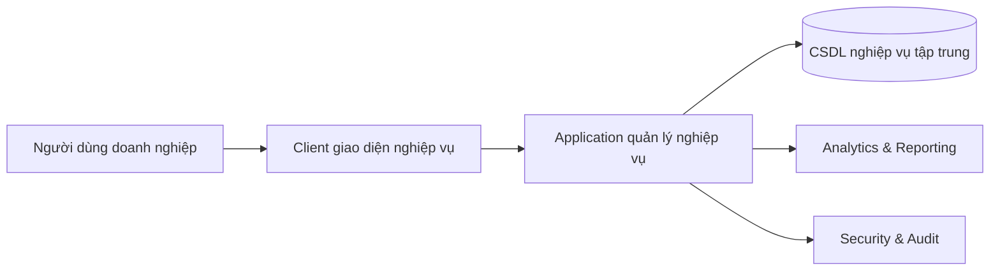

# BÁO CÁO BÀI TẬP LỚN MÔN HỆ THỐNG THÔNG TIN QUẢN LÝ

## Đề tài: Phân tích và xây dựng hệ thống thông tin quản lý nhân sự phục vụ hoạt động doanh nghiệp

---

## Lời mở đầu

Trong môi trường cạnh tranh hiện nay, năng lực quản trị của doanh nghiệp không còn được quyết định chỉ bởi vốn hoặc công nghệ sản xuất, mà ngày càng phụ thuộc vào chất lượng tổ chức thông tin. Đặc biệt đối với doanh nghiệp có cơ cấu lao động theo dự án, nơi nhân sự liên tục dịch chuyển giữa các nhóm công việc và phát sinh nhiều trạng thái vận hành theo thời gian, bài toán quản lý nhân sự đã trở thành bài toán quản lý dữ liệu và quy trình ở cấp hệ thống. Khi thông tin nhân sự bị chia cắt giữa bảng tính, email, biểu mẫu thủ công và các phần mềm rời rạc, doanh nghiệp thường đối mặt với tình trạng chậm ra quyết định, thiếu minh bạch trách nhiệm, khó đánh giá hiệu suất và khó điều phối nguồn lực đúng thời điểm.

Báo cáo này tiếp cận đề tài theo đúng tinh thần môn Hệ thống thông tin quản lý: đặt vấn đề từ nhu cầu vận hành doanh nghiệp, phân tích chức năng theo mục tiêu quản trị, làm rõ luồng dữ liệu và luồng nghiệp vụ, đồng thời đánh giá khả năng hỗ trợ ra quyết định của hệ thống. Trọng tâm của báo cáo không phải là mô tả kỹ thuật lập trình, mà là phân tích cách hệ thống thông tin quản lý nhân sự giúp doanh nghiệp giải quyết vấn đề thực tế, chuẩn hóa quy trình, nâng cao hiệu quả quản trị và tạo nền tảng dữ liệu cho điều hành chiến thuật và chiến lược.

---

# CHƯƠNG 1 — GIỚI THIỆU ĐỀ TÀI

## 1.1. Bối cảnh và lý do chọn đề tài

Trong doanh nghiệp hiện đại, nhân sự là nguồn lực tạo ra giá trị trực tiếp thông qua hoạt động chuyên môn và gián tiếp thông qua năng lực phối hợp tổ chức. Tuy nhiên, quá trình quản lý nhân sự trong thực tế thường phát sinh nhiều điểm nghẽn: thông tin hồ sơ không đồng bộ, quyết định duyệt nghỉ phép chậm, không nhìn thấy bức tranh phân bổ nhân lực theo dự án, dữ liệu tiến độ công việc thiếu chuẩn hóa, và khó truy vết khi có sai lệch trong phê duyệt hoặc tính toán công lao động. Khi doanh nghiệp tăng quy mô, các điểm nghẽn này không chỉ gây tốn thời gian tác nghiệp mà còn ảnh hưởng đến chất lượng ra quyết định ở cấp quản lý.

Lý do cốt lõi của việc xây dựng hệ thống thông tin quản lý nhân sự là chuyển doanh nghiệp từ mô hình “quản lý theo hồ sơ rời rạc” sang mô hình “quản trị theo dữ liệu tích hợp”. Trong mô hình mới, mỗi sự kiện nghiệp vụ như tuyển dụng, phê duyệt lịch, ghi nhận chấm công theo công việc, đánh giá năng lực hay cập nhật vị trí đều được biểu diễn bằng dữ liệu có cấu trúc, có quan hệ và có khả năng kiểm chứng. Nhờ đó, thông tin không chỉ phục vụ thao tác hiện tại mà còn trở thành tài sản tri thức phục vụ phân tích, dự báo và cải tiến quản lý lâu dài.

Về ý nghĩa học thuật, đề tài là trường hợp điển hình để vận dụng kiến thức hệ thống thông tin quản lý (MIS) trong việc kết nối ba lớp giá trị: lớp tác nghiệp (xử lý giao dịch), lớp giám sát quản lý (báo cáo quản trị) và lớp hỗ trợ quyết định (hỗ trợ lựa chọn phương án điều hành). Đây cũng là lý do đề tài phù hợp với mục tiêu đào tạo của học phần.

## 1.2. Mục tiêu của hệ thống

Mục tiêu tổng thể của hệ thống là xây dựng một nền tảng thông tin quản trị nhân sự giúp doanh nghiệp vận hành nhất quán, minh bạch và ra quyết định dựa trên dữ liệu. Mục tiêu này được cụ thể hóa theo năm định hướng quản lý.

Thứ nhất, hệ thống phải chuẩn hóa quy trình nhân sự cốt lõi như quản lý hồ sơ, phân công dự án, quản lý lịch làm việc, nghỉ phép, đánh giá và đào tạo. Thứ hai, hệ thống phải tạo dòng dữ liệu liên thông giữa các phân hệ, tránh việc mỗi bộ phận lưu dữ liệu riêng biệt. Thứ ba, hệ thống phải hỗ trợ kiểm soát quyền truy cập theo vai trò và phạm vi phụ trách, bảo đảm đúng người, đúng việc, đúng dữ liệu. Thứ tư, hệ thống phải cung cấp thông tin tổng hợp theo thời gian thực để nhà quản lý theo dõi tải nguồn lực và chất lượng vận hành. Thứ năm, hệ thống phải hình thành nền tảng dữ liệu để phục vụ các quyết định trung hạn như kế hoạch tuyển dụng, kế hoạch đào tạo, phân bổ nguồn lực theo dự án và kiểm soát chi phí nhân sự.

Tóm lại, mục tiêu của hệ thống không dừng ở “số hóa biểu mẫu”, mà hướng đến “nâng cấp năng lực quản trị doanh nghiệp” thông qua hệ thống thông tin tích hợp.

## 1.3. Phạm vi nghiên cứu và áp dụng

Phạm vi của hệ thống bao gồm toàn bộ chuỗi nghiệp vụ quản lý nhân sự có trong doanh nghiệp vận hành theo dự án: quản trị nhân viên, phòng ban, vị trí/chức vụ, lịch làm việc và yêu cầu nghỉ/làm việc từ xa, chấm công theo đầu việc, báo cáo tiến độ hằng ngày, quản trị dự án và khách hàng, tuyển dụng và tiếp nhận nhân sự mới, quản lý đào tạo, đánh giá thực tập sinh theo năng lực, quản trị ngân sách và chi phí dự án, quản lý hóa đơn và công nợ, cùng các phân hệ phân quyền - cấu hình - kiểm soát.

Hệ thống được định vị là nền tảng quản lý cấp doanh nghiệp nội bộ, phục vụ các vai trò quản trị như quản trị viên, quản lý dự án/trưởng nhóm, nhân sự/tuyển dụng, và nhân viên. Các nội dung ngoài phạm vi hoàn thiện ở giai đoạn hiện tại gồm các bài toán tích hợp kế toán trong hệ thống hoạch định nguồn lực doanh nghiệp (ERP), mô hình dự báo nâng cao bằng trí tuệ nhân tạo, và cơ chế quy trình phê duyệt nhiều tầng cực kỳ đặc thù theo từng tập đoàn lớn. Tuy nhiên, kiến trúc hiện tại đã đủ cơ sở để mở rộng các lớp chức năng đó trong lộ trình tiếp theo.

## 1.4. Đối tượng sử dụng và kỳ vọng quản trị

Đối tượng sử dụng không đồng nhất về mục tiêu nghiệp vụ. Quản trị viên quan tâm đến tính toàn vẹn hệ thống, chính sách quyền và vận hành ổn định. Quản lý dự án/trưởng nhóm quan tâm đến năng lực đội nhóm, tiến độ công việc, tỷ lệ hiện diện, và hiệu quả nguồn lực theo dự án. Bộ phận nhân sự/tuyển dụng quan tâm đến chuỗi xử lý ứng viên, chất lượng ứng viên, chính sách nhân sự và đánh giá phát triển. Nhân viên quan tâm đến việc thực hiện thao tác đúng quy trình: gửi yêu cầu, ghi nhận công việc, cập nhật thông tin phục vụ quản lý.

Việc phân định rõ nhóm người dùng và mục tiêu sử dụng giúp hệ thống được thiết kế theo định hướng “thông tin đúng vai trò”, giảm nhiễu dữ liệu, tăng hiệu suất vận hành, và tăng chất lượng quyết định ở từng cấp quản trị.

---

# CHƯƠNG 2 — CƠ SỞ LÝ THUYẾT VÀ KHUNG PHÂN TÍCH

## 2.1. Hệ thống thông tin quản lý trong doanh nghiệp

Về mặt lý thuyết, hệ thống thông tin quản lý là cấu trúc tổ chức thông tin nhằm hỗ trợ thực thi và kiểm soát mục tiêu doanh nghiệp. Hệ thống thông tin quản lý (MIS) vận hành hiệu quả khi thực hiện đồng thời ba chức năng: thu thập dữ liệu chuẩn hóa từ vận hành, xử lý và tổng hợp dữ liệu theo logic quản trị, và phân phối thông tin đúng thời điểm cho người ra quyết định. Như vậy, MIS không phải công cụ kỹ thuật đơn thuần mà là thành phần của hệ thống quản trị doanh nghiệp.

Trong bối cảnh quản trị nhân sự, hệ thống thông tin quản lý (MIS) cần trả lời các câu hỏi cốt lõi: tổ chức đang có bao nhiêu nguồn lực, nguồn lực đang phân bổ ở đâu, mức độ sử dụng nguồn lực ra sao, năng lực nào đang thiếu, và chính sách nào cần điều chỉnh. Hệ thống trong đề tài được xây dựng nhằm cung cấp câu trả lời có căn cứ dữ liệu cho các câu hỏi này.

## 2.2. HRM như một hệ thống thông tin doanh nghiệp tích hợp

Một sai lầm phổ biến là xem hệ thống quản trị nhân sự (HRM) chỉ là “hồ sơ nhân viên”. Về bản chất, HRM hiện đại phải quản lý toàn vòng đời nhân lực: từ thu hút ứng viên, sàng lọc, phỏng vấn, tiếp nhận nhân sự mới, phân công công việc, theo dõi hiệu suất, đánh giá năng lực, đào tạo, đến kiểm soát quyền lợi và lộ trình phát triển. Khi các điểm dữ liệu này không liên thông, quyết định nhân sự dễ thiếu chính xác.

Vì vậy, HRM cần tích hợp với các phân hệ vận hành khác như dự án, chấm công, ngân sách và báo cáo quản trị. Đây cũng chính là định hướng của hệ thống trong đề tài: dữ liệu nhân sự là lõi, nhưng các quyết định quản trị được rút ra từ tương quan giữa dữ liệu nhân sự với dữ liệu công việc và dữ liệu tài chính vận hành.

## 2.3. Mô hình khách - máy chủ (client-server) và vai trò quản trị

Mô hình khách - máy chủ (client-server) có giá trị quản trị vì thiết lập một điểm kiểm soát nghiệp vụ tập trung. Người dùng thao tác ở phía giao diện, nhưng mọi quy tắc xác thực, phân quyền, kiểm tra điều kiện và ghi nhận thay đổi đều tập trung tại máy chủ xử lý nghiệp vụ. Điều này bảo đảm cùng một chính sách được áp dụng thống nhất cho mọi người dùng, tránh tình trạng “mỗi nơi xử lý một kiểu”.

Ở góc độ hệ thống thông tin quản lý (MIS), mô hình này giúp doanh nghiệp quản lý rủi ro thông tin tốt hơn, đồng thời tạo dữ liệu nhật ký tập trung để phục vụ kiểm soát nội bộ và cải tiến quy trình.

## 2.4. Quản trị dữ liệu và nguồn lực thông tin

Dữ liệu trong hệ thống quản lý nhân sự không chỉ là dữ liệu tác nghiệp mà còn là tài sản chiến lược. Quản trị dữ liệu hiệu quả đòi hỏi bốn tiêu chí: đúng (accuracy), đủ (completeness), nhất quán (consistency), và có thể truy xuất (traceability). Khi dữ liệu đạt bốn tiêu chí này, doanh nghiệp mới có thể tin cậy vào báo cáo và quyết định quản lý.

Hệ thống được thiết kế theo mô hình dữ liệu quan hệ với ràng buộc trạng thái nghiệp vụ, liên kết thực thể và lịch sử thay đổi. Nhờ đó, cùng một dữ liệu có thể được khai thác ở nhiều mục tiêu: vận hành tác nghiệp, kiểm soát tuân thủ, thống kê điều hành, và phân tích xu hướng nguồn lực.

## 2.5. Hệ thống hỗ trợ ra quyết định (DSS) trong quản trị nhân sự

Hệ thống hỗ trợ ra quyết định (DSS) trong doanh nghiệp nhân sự không nhất thiết là mô hình dự báo phức tạp; ở mức cơ bản, DSS là khả năng chuyển dữ liệu rời rạc thành thông tin có ngữ cảnh để quản lý lựa chọn phương án hành động. Ví dụ, khi thấy tỷ lệ vắng mặt tăng trong một dự án, quản lý cần dữ liệu phân rã chi tiết để biết nguyên nhân thuộc nghỉ phép, làm việc tại địa điểm khách hàng, hay thiếu phân bổ công việc; khi thấy mức sử dụng nguồn lực giảm, cần truy ngược dữ liệu đầu việc và tiến độ để xác định vấn đề.

Hệ thống trong đề tài hỗ trợ DSS qua các phân hệ tổng hợp và báo cáo, kết hợp với dữ liệu giao dịch từ lịch làm việc, báo cáo công việc hằng ngày, chấm công theo đầu việc, dự án và tài chính vận hành.

---

# CHƯƠNG 3 — PHÂN TÍCH NGHIỆP VỤ VÀ CHỨC NĂNG HỆ THỐNG

## 3.1. Phân tích bài toán nghiệp vụ doanh nghiệp

Doanh nghiệp mục tiêu có các đặc điểm điển hình: nhân sự thuộc nhiều phòng ban, tham gia đa dự án, có luồng phê duyệt thường xuyên, và yêu cầu báo cáo định kỳ cho nhiều cấp quản lý. Trong bối cảnh đó, bài toán nghiệp vụ không chỉ là lưu thông tin cá nhân, mà là điều phối nguồn lực đúng lúc, đúng nơi, đúng năng lực, trong giới hạn chính sách và chi phí.

Các vấn đề thực tế doanh nghiệp cần giải quyết gồm: thiếu tầm nhìn tổng quan về hiện diện nhân sự theo ngày; khó xác định hiệu suất theo đầu việc và dự án; quy trình tuyển dụng và tiếp nhận nhân sự mới chưa liên thông với dữ liệu vận hành; thiếu công cụ đánh giá năng lực dựa trên tiêu chí chuẩn; khó kiểm soát công nợ và chi phí gắn với dự án; và thiếu cơ chế phân quyền đủ chặt ở môi trường đa vai trò.

Hệ thống được xây dựng để giải quyết trực tiếp các vấn đề trên theo nguyên tắc: doanh nghiệp cần gì - hệ thống xử lý như thế nào - lợi ích quản trị thu được là gì.

## 3.2. Cụm chức năng quản trị nhân sự cốt lõi

### 3.2.1. Quản lý nhân viên

Mục đích của chức năng quản lý nhân viên là tạo hồ sơ nguồn lực tập trung và nhất quán cho toàn doanh nghiệp. Vấn đề thực tế mà chức năng này giải quyết là tình trạng dữ liệu nhân sự rời rạc, thiếu chuẩn và khó truy xuất theo tiêu chí quản trị. Doanh nghiệp cần chức năng này vì mọi quyết định về phân bổ, đánh giá, đào tạo hay tuyển dụng đều bắt đầu từ dữ liệu nhân sự đúng.

Về mục tiêu quản lý, chức năng hỗ trợ nhà quản lý nắm tức thời cơ cấu nhân sự theo phòng ban, vị trí, dự án và trạng thái lao động. Nó tối ưu quy trình cập nhật hồ sơ, giảm thời gian tổng hợp thủ công và giảm sai lệch thông tin giữa các bộ phận.

Về nghiệp vụ thực tế, actor tham gia gồm Admin/Manager nhập hoặc cập nhật thông tin nhân viên; hệ thống kiểm tra dữ liệu bắt buộc, lưu thông tin và phản hồi danh sách/chi tiết phục vụ tra cứu. Dữ liệu đầu vào gồm thông tin định danh, tổ chức và lịch làm việc cố định; dữ liệu đầu ra là hồ sơ nhân sự chuẩn hóa và dữ liệu nền cho các phân hệ khác.

Về luồng hoạt động, người dùng tạo/sửa hồ sơ, hệ thống kiểm tra điều kiện hợp lệ, cập nhật dữ liệu và ghi nhận lịch sử thay đổi. Về ý nghĩa dữ liệu, hồ sơ nhân viên là điểm liên kết trung tâm cho báo cáo công việc hằng ngày, chấm công theo đầu việc, dự án, đánh giá năng lực và chính sách phép, do đó có vai trò nền tảng trong toàn bộ hệ thống thông tin quản lý nhân sự.

### 3.2.2. Quản lý phòng ban, vị trí, chức vụ và lịch sử thăng tiến

Mục đích của nhóm chức năng này là mô hình hóa cấu trúc tổ chức và lộ trình nghề nghiệp, giải quyết vấn đề “không có chuẩn chung về vai trò công việc” trong doanh nghiệp. Nếu không có mô hình tổ chức chuẩn, doanh nghiệp khó phân quyền, khó đánh giá năng lực theo chuẩn vị trí, và khó xây dựng kế hoạch kế thừa nhân sự.

Mục tiêu quản lý là giúp nhà quản trị nhìn rõ bức tranh tổ chức theo nhiều lớp: đơn vị phòng ban, vai trò chuyên môn, cấp bậc quản trị. Đồng thời, lịch sử thăng tiến giúp đánh giá quá trình phát triển của nhân sự theo thời gian, là đầu vào cho quyết định đãi ngộ và quy hoạch nhân lực.

Nghiệp vụ thực tế gồm tạo danh mục tổ chức, gán vị trí/chức vụ cho nhân viên, cập nhật sự kiện thăng tiến kèm ngày hiệu lực. Actor chủ yếu là Admin/HR/Manager. Đầu vào là dữ liệu danh mục và quyết định thay đổi vai trò; đầu ra là cấu trúc tổ chức cập nhật và timeline phát triển nhân sự.

Ý nghĩa dữ liệu ở đây rất lớn đối với quản trị: dữ liệu vị trí/chức vụ liên quan trực tiếp đến phân quyền, tuyển dụng thay thế, đánh giá năng lực theo chuẩn, và phân tích chi phí lương theo cấp bậc.

## 3.3. Cụm chức năng lịch làm việc, nghỉ phép và hiện diện nhân sự

### 3.3.1. Quản lý yêu cầu nghỉ phép, làm việc từ xa và đổi lịch làm việc

Chức năng này giải quyết bài toán điều phối hiện diện nhân sự theo ngày. Doanh nghiệp cần biết trước ai vắng mặt, ai làm việc từ xa, và mức độ ảnh hưởng đến năng lực thực thi dự án. Nếu không có quy trình yêu cầu chuẩn hóa, quyết định giao việc thường lệch với khả năng hiện diện thực tế.

Mục tiêu quản lý của chức năng là tạo hàng đợi phê duyệt có kiểm soát, cho phép người quản lý cân bằng quyền lợi nhân viên và yêu cầu vận hành. Chức năng cũng giúp giảm xung đột lịch, giảm quyết định cảm tính và tăng tính minh bạch khi từ chối hoặc phê duyệt yêu cầu.

Nghiệp vụ thực tế diễn ra theo chu trình: nhân viên gửi yêu cầu theo loại và thời điểm; hệ thống kiểm tra điều kiện hợp lệ; yêu cầu chuyển trạng thái chờ duyệt; quản lý duyệt hoặc từ chối kèm lý do; hệ thống cập nhật lịch tổng hợp và lưu dấu vết xử lý. Actor gồm Employee, Manager và Admin giám sát.

Dữ liệu đầu vào là loại yêu cầu, thời gian, lý do, người gửi; đầu ra là trạng thái phê duyệt, lịch hiện diện theo ngày và dữ liệu lịch sử quyết định. Dữ liệu này hỗ trợ thống kê tỷ lệ vắng mặt, mức độ tuân thủ chính sách, và năng lực bố trí nguồn lực theo dự án.

### 3.3.2. Quản lý phép năm, giao dịch phép, loại phép và ngày nghỉ công ty

Doanh nghiệp cần tách bạch hai vấn đề: quyền nghỉ theo chính sách và yêu cầu nghỉ cụ thể theo ngày. Chức năng leave balance và leave type/off day giải quyết chính xác bài toán đó. Nếu thiếu lớp dữ liệu phép năm, việc duyệt nghỉ dễ thiếu căn cứ và gây tranh chấp quyền lợi.

Mục tiêu quản lý là bảo đảm tính công bằng chính sách, kiểm soát số dư phép theo từng nhân sự, và chuẩn hóa loại nghỉ trong toàn doanh nghiệp. Nghiệp vụ thực tế gồm thiết lập chỉ tiêu phép năm, ghi nhận giao dịch tăng/giảm phép, định nghĩa loại nghỉ có lương/không lương, và thiết lập ngày nghỉ công ty để ràng buộc các quy trình liên quan.

Actor chính là HR/Admin, Manager có quyền tra cứu theo phạm vi. Đầu vào gồm dữ liệu năm, số ngày phép, chính sách loại nghỉ, danh sách ngày nghỉ; đầu ra là số dư phép, lịch sử giao dịch phép và tập dữ liệu chính sách nghỉ đồng bộ. Dữ liệu này là nền tảng cho báo cáo nhân sự và đối chiếu với tính lương.

### 3.3.3. Quản lý yêu cầu đăng ký giờ làm việc và yêu cầu làm việc tại địa điểm khách hàng

Trong thực tế doanh nghiệp, ngoài nghỉ phép còn có nhu cầu điều chỉnh khung giờ làm việc và đề nghị onsite. Hai chức năng này giúp hệ thống phản ánh đúng các trạng thái lao động linh hoạt hiện đại. Doanh nghiệp cần chúng để đảm bảo linh hoạt vận hành nhưng vẫn giữ kiểm soát chính sách.

Mục tiêu quản lý là theo dõi các biến động hình thức làm việc, giảm rủi ro sai lệch giữa hiện diện thực tế và kế hoạch dự án, đồng thời tạo dữ liệu cho đánh giá năng suất theo điều kiện làm việc khác nhau.

Nghiệp vụ gồm nhân viên gửi đề nghị, quản lý duyệt/từ chối, hệ thống cập nhật trạng thái và lịch sử xử lý. Đầu vào là thời gian, hình thức, lý do; đầu ra là quyết định phê duyệt và dữ liệu hiện diện bổ sung cho lịch tổng hợp.

## 3.4. Cụm chức năng theo dõi công việc và hiệu suất

### 3.4.1. Daily report

Daily report giải quyết vấn đề “quản lý không biết chính xác công việc đã thực hiện mỗi ngày”. Doanh nghiệp cần daily report để có kênh cập nhật tiến độ định tính theo nhân sự và dự án, đặc biệt khi tổ chức làm việc phân tán hoặc đa dự án.

Mục tiêu quản lý là tăng khả năng giám sát tiến độ gần thời gian thực, hỗ trợ phát hiện sớm chậm trễ và cải thiện phối hợp liên nhóm. Nghiệp vụ gồm nhân viên ghi nhận nội dung công việc theo ngày, quản lý tra cứu theo cá nhân hoặc dự án, và hệ thống lưu dữ liệu theo cấu trúc thời gian.

Dữ liệu đầu vào gồm ngày báo cáo, dự án, nhiệm vụ, nội dung thực hiện; đầu ra là dòng thời gian công việc có thể lọc và tổng hợp. Ý nghĩa dữ liệu là cung cấp nền tảng định tính bổ sung cho dữ liệu định lượng từ chấm công theo đầu việc.

### 3.4.2. Chấm công chi tiết theo đầu việc

Chức năng chấm công theo đầu việc được xây dựng để giải quyết câu hỏi quản trị “thời gian lao động đang được sử dụng như thế nào”. Nếu không có dữ liệu chấm công theo đầu việc, doanh nghiệp chỉ có cảm nhận về năng suất chứ không có số liệu để điều phối nguồn lực.

Mục tiêu quản lý của chức năng là đo lường mức độ sử dụng nguồn lực theo dự án - nhiệm vụ - thời gian, chuẩn hóa quy trình gửi duyệt/phê duyệt, và tạo dữ liệu cho phân tích hiệu suất. Nghiệp vụ gồm nhân viên ghi nhận giờ làm, gửi theo kỳ, quản lý dự án duyệt/từ chối, hệ thống khóa trạng thái theo quy định.

Actor gồm nhân viên, quản lý dự án/trưởng nhóm, và quản trị viên giám sát. Đầu vào là thời gian làm việc, đầu việc, dự án, ghi chú; đầu ra là bản ghi công việc có trạng thái phê duyệt và dữ liệu thống kê theo kỳ. Dữ liệu chấm công có ý nghĩa chiến lược vì liên kết trực tiếp với quản trị năng suất, chi phí lao động và hiệu quả dự án.

### 3.4.3. Bảng điều khiển thống kê mức sử dụng nguồn lực và báo cáo ngoại lệ

Doanh nghiệp cần một điểm nhìn tổng quan để chuyển dữ liệu báo cáo công việc hằng ngày, chấm công và lịch làm việc thành tín hiệu quản trị. Bảng điều khiển thống kê mức sử dụng nguồn lực và báo cáo ngoại lệ giải quyết nhu cầu này bằng cách tổng hợp chỉ số quan trọng và cho phép xem sâu dữ liệu chi tiết khi có bất thường.

Mục tiêu quản lý là giảm thời gian phát hiện vấn đề, tăng tốc phản ứng điều hành và chuẩn hóa trao đổi giữa các cấp quản lý dựa trên cùng một bộ số liệu. Đầu vào là dữ liệu tổng hợp đa nguồn; đầu ra là KPI, cảnh báo và xu hướng. Dữ liệu này trực tiếp phục vụ quyết định điều phối nhân lực, điều chỉnh kế hoạch dự án và ưu tiên xử lý rủi ro.

## 3.5. Cụm chức năng quản lý dự án và tài chính vận hành

### 3.5.1. Quản lý dự án, thành viên, khách hàng và tài liệu

Mục đích của cụm chức năng này là liên kết quản trị nhân sự với đơn vị tạo giá trị kinh doanh là dự án. Doanh nghiệp cần biết dự án đang chạy với đội hình nào, tài liệu nào, và liên hệ với khách hàng nào để đảm bảo thực thi minh bạch và nhất quán.

Mục tiêu quản lý là chuẩn hóa vòng đời thông tin dự án, hỗ trợ PM điều phối thành viên, và giúp lãnh đạo theo dõi tình trạng danh mục dự án ở mức tổng thể. Nghiệp vụ gồm tạo/cập nhật dự án, gán thành viên, liên kết khách hàng, quản lý tài liệu dự án và truy xuất tiến độ theo dữ liệu daily.

Dữ liệu đầu vào gồm thông tin dự án, thành viên, tài liệu, khách hàng; dữ liệu đầu ra là hồ sơ dự án toàn diện phục vụ giám sát thực thi và kiểm soát trách nhiệm.

### 3.5.2. Quản lý đầu việc dự án và thành viên hỗ trợ theo dõi

Doanh nghiệp cần phân rã công việc đến mức đầu việc để đo lường năng suất chính xác. Chức năng quản lý đầu việc tạo danh mục nhiệm vụ chuẩn cho chấm công; chức năng thành viên hỗ trợ theo dõi phản ánh cơ chế hỗ trợ hoặc học việc trong dự án thực tế.

Mục tiêu quản lý là tăng độ chính xác của phân tích công việc, đồng thời theo dõi năng lực kế thừa và hỗ trợ chéo trong đội nhóm. Nghiệp vụ gồm định nghĩa đầu việc theo dự án, gán quan hệ hỗ trợ theo dõi, và ghi nhận dữ liệu thời gian thực hiện theo cấu trúc đó.

Ý nghĩa dữ liệu là giúp PM hiểu rõ nguồn lực nào đang thực hiện trực tiếp, nguồn lực nào đang hỗ trợ, từ đó tối ưu cách phân công và đào tạo nội bộ.

### 3.5.3. Quản lý ngân sách dự án, đề nghị chi phí và hóa đơn

Đây là cụm chức năng quan trọng vì kết nối trực tiếp vận hành nhân lực với kiểm soát tài chính. Project budget giúp theo dõi kế hoạch và thực tế theo hạng mục. Expense claim chuẩn hóa quy trình đề nghị chi phí và phê duyệt. Invoice quản lý dòng công nợ phải thu từ dự án.

Mục tiêu quản lý là kiểm soát hiệu quả sử dụng ngân sách, tăng kỷ luật tài chính, và cải thiện dự báo dòng tiền. Nghiệp vụ thực tế gồm lập ngân sách, ghi nhận phát sinh chi phí, duyệt/từ chối đề nghị, phát hành hóa đơn, theo dõi trạng thái thanh toán và báo cáo công nợ.

Actor tham gia gồm PM, bộ phận tài chính, Admin. Đầu vào là số liệu chi phí/doanh thu/chứng từ; đầu ra là báo cáo budget-vs-actual, trạng thái đề nghị chi phí, trạng thái hóa đơn và số liệu công nợ. Dữ liệu này hỗ trợ quyết định điều chỉnh kế hoạch dự án, đánh giá biên lợi nhuận và quản trị rủi ro thanh khoản.

## 3.6. Cụm chức năng tuyển dụng, đào tạo và phát triển năng lực

### 3.6.1. Tuyển dụng và quản lý ứng viên

Doanh nghiệp cần chức năng tuyển dụng để bảo đảm nguồn cung nhân lực phù hợp với nhu cầu tăng trưởng. Chức năng này giải quyết vấn đề chuỗi xử lý ứng viên thiếu minh bạch, khó đánh giá hiệu quả kênh tuyển dụng, và khó bàn giao dữ liệu từ tuyển dụng sang vận hành nhân sự.

Mục tiêu quản lý là theo dõi toàn bộ hành trình ứng viên theo trạng thái, đo lường tỷ lệ chuyển đổi và tối ưu chi phí tuyển dụng. Nghiệp vụ gồm tạo nhu cầu tuyển dụng, thu thập hồ sơ ứng viên, xử lý trạng thái theo quy trình, tổ chức phỏng vấn và chuyển sang bước tiếp nhận nhân sự mới.

Đầu vào gồm hồ sơ cá nhân, kỹ năng, nguồn hồ sơ ứng viên, vị trí tuyển; đầu ra là chuỗi xử lý ứng viên định lượng và danh sách ứng viên sẵn sàng tiếp nhận. Dữ liệu tuyển dụng hỗ trợ quyết định kế hoạch nhân lực và chiến lược thu hút nhân tài.

### 3.6.2. Đào tạo và hồ sơ đào tạo

Doanh nghiệp cần đào tạo để thu hẹp khoảng cách năng lực so với yêu cầu công việc. Chức năng đào tạo giải quyết vấn đề đào tạo thiếu kế hoạch và thiếu bằng chứng hiệu quả. Mục tiêu quản lý là kiểm soát danh mục chương trình đào tạo, theo dõi nhân sự tham gia và đánh giá kết quả đào tạo.

Nghiệp vụ thực tế gồm xây dựng kế hoạch đào tạo, ghi nhận kết quả, lưu chứng chỉ và theo dõi chứng chỉ sắp hết hạn. Actor gồm HR, Manager, Admin. Đầu vào là dữ liệu chương trình và kết quả học tập; đầu ra là hồ sơ năng lực sau đào tạo và cơ sở dữ liệu phát triển nhân lực.

Dữ liệu đào tạo giúp doanh nghiệp ra quyết định về đề bạt, phân công dự án yêu cầu kỹ năng cao, và hoạch định ngân sách đào tạo có trọng tâm.

### 3.6.3. Cấu hình tiêu chí năng lực, cấu hình thang điểm và đánh giá thực tập sinh

Nhóm chức năng này giải quyết vấn đề đánh giá năng lực thiếu chuẩn hóa. Doanh nghiệp cần tiêu chí đánh giá có cấu trúc theo vị trí và nhóm người dùng để đảm bảo công bằng và so sánh được giữa các kỳ đánh giá.

Mục tiêu quản lý là chuyển đánh giá từ cảm tính sang bán định lượng: định nghĩa tiêu chí, gán trọng số, tính tổng điểm và quy đổi cấp độ. Nghiệp vụ gồm cấu hình bộ tiêu chí, thực hiện đánh giá theo kỳ, phê duyệt kết quả và lưu lịch sử đánh giá.

Đầu vào là điểm số/nhận xét theo từng tiêu chí; đầu ra là kết quả năng lực theo cấp độ và dữ liệu theo dõi phát triển nhân tài. Dữ liệu này phục vụ quyết định giữ chân, nâng bậc, chuyển đổi vai trò hoặc điều chỉnh kế hoạch đào tạo.

## 3.7. Cụm chức năng tài chính nhân sự và chính sách trả công

### 3.7.1. Quản lý cấu trúc lương và kỳ lương

Chức năng bảng lương giải quyết bài toán minh bạch và kiểm soát chi phí nhân sự. Doanh nghiệp cần có cơ chế thống nhất để quản lý cấu phần lương, kỳ lương và trạng thái phê duyệt trả lương, tránh rủi ro sai sót thủ công và tranh chấp quyền lợi.

Mục tiêu quản lý là chuẩn hóa quy trình từ tính lương đến phê duyệt và chi trả, đồng thời tạo dữ liệu chi phí nhân sự theo kỳ để lãnh đạo theo dõi quỹ lương. Nghiệp vụ gồm thiết lập cấu trúc lương, tạo kỳ lương, tính toán từng khoản lương, duyệt và ghi nhận trả lương.

Đầu vào là thông số lương, phụ cấp, thưởng, khấu trừ, ngày công; đầu ra là net pay theo nhân sự và báo cáo tổng hợp chi phí nhân sự. Dữ liệu này có vai trò quan trọng trong lập ngân sách và quản trị hiệu quả tài chính.

## 3.8. Cụm chức năng phân quyền, cấu hình và kiểm soát vận hành

### 3.8.1. Phân quyền tài khoản và quản lý phạm vi dữ liệu

Doanh nghiệp cần phân quyền để bảo vệ tài sản thông tin và bảo đảm trách nhiệm quản lý. Chức năng identity và policy quyền giải quyết vấn đề truy cập vượt phạm vi hoặc thao tác không đúng thẩm quyền.

Mục tiêu quản lý là thực thi nguyên tắc tối thiểu quyền, đồng thời cho phép linh hoạt điều chỉnh chính sách khi tổ chức thay đổi. Nghiệp vụ gồm tạo tài khoản, gán vai trò, cấu hình quyền theo tài nguyên-hành động, và thiết lập phạm vi dữ liệu theo phòng ban/dự án.

Đầu vào là chính sách quyền và cấu trúc tổ chức; đầu ra là ma trận truy cập được áp dụng trong quá trình hệ thống vận hành. Dữ liệu quyền có ý nghĩa trọng yếu trong kiểm toán và quản trị rủi ro nội bộ.

### 3.8.2. Cấu hình hệ thống và danh mục dùng chung

Thiết lập hệ thống và các danh mục dữ liệu dùng chung cho phép doanh nghiệp điều chỉnh chính sách vận hành mà không phá vỡ quy trình. Doanh nghiệp cần lớp này để duy trì tính linh hoạt quản trị khi chính sách thay đổi theo giai đoạn.

Mục tiêu quản lý là đồng bộ “ngôn ngữ dữ liệu” trên toàn tổ chức, giảm sai lệch khi nhập liệu và tăng chất lượng báo cáo liên phòng ban. Dữ liệu đầu ra là bộ tham số thống nhất cho tất cả phân hệ.

### 3.8.3. Nhật ký kiểm soát, trạng thái sức khỏe dịch vụ và giám sát hệ thống

Hệ thống thông tin quản lý muốn vận hành bền vững cần có chức năng giám sát và truy vết. Nhật ký kiểm soát giúp doanh nghiệp biết ai đã làm gì và khi nào; trạng thái sức khỏe dịch vụ giúp theo dõi mức ổn định; nhật ký vận hành giúp phân tích sự cố và cải tiến quy trình.

Mục tiêu quản lý là tăng độ tin cậy vận hành, giảm thời gian xử lý sự cố và tăng trách nhiệm giải trình. Dữ liệu đầu vào là sự kiện vận hành và thao tác người dùng; dữ liệu đầu ra là nhật ký hệ thống và báo cáo kiểm soát.

## 3.9. Tổng hợp vai trò quản lý của các cụm chức năng

Để nhìn rõ giá trị của hệ thống thông tin quản lý (MIS), có thể tổng hợp theo logic: vấn đề doanh nghiệp - chức năng giải pháp - lợi ích quản lý.

| Vấn đề doanh nghiệp | Chức năng giải pháp | Lợi ích quản lý đạt được |
|---|---|---|
| Dữ liệu nhân sự phân tán | Quản lý nhân viên + phòng ban + vị trí + chức vụ | Hồ sơ tập trung, tra cứu nhanh, giảm sai lệch |
| Khó điều phối hiện diện theo ngày | Quản lý lịch làm việc + phép năm + ngày nghỉ + đăng ký giờ làm/làm việc tại khách hàng | Chủ động bố trí nguồn lực, giảm xung đột lịch |
| Thiếu đo lường hiệu suất | Báo cáo công việc hằng ngày + chấm công theo đầu việc + đầu việc dự án | Đánh giá tiến độ và năng suất có căn cứ |
| Dự án thiếu kiểm soát chi phí/doanh thu | Ngân sách dự án + đề nghị chi phí + hóa đơn | Nâng chất lượng kiểm soát tài chính dự án |
| Chuỗi ứng viên thiếu minh bạch | Tuyển dụng + lịch phỏng vấn + nguồn ứng viên | Tối ưu tuyển dụng và kế hoạch nhân lực |
| Đánh giá năng lực cảm tính | Cấu hình năng lực/thang điểm + đánh giá thực tập sinh + đào tạo | Chuẩn hóa phát triển nhân tài |
| Rủi ro truy cập dữ liệu | Quản trị định danh + phân quyền + phạm vi dữ liệu | Bảo mật và tuân thủ nội bộ |
| Thiếu thông tin điều hành tổng quan | Bảng điều khiển thống kê + nhật ký kiểm soát | Ra quyết định nhanh và minh bạch |

---

# CHƯƠNG 4 — THIẾT KẾ HỆ THỐNG THEO GÓC NHÌN QUẢN TRỊ

## 4.1. Kiến trúc tổng thể và ý nghĩa quản lý

Kiến trúc của hệ thống được thiết kế theo mô hình tập trung xử lý nghiệp vụ, trong đó frontend đóng vai trò lớp tương tác người dùng, backend đóng vai trò lớp thực thi chính sách quản lý, và cơ sở dữ liệu đóng vai trò kho tri thức vận hành của doanh nghiệp.

Ý nghĩa quản lý của kiến trúc này là bảo đảm mọi luồng nghiệp vụ đi qua cùng một cơ chế kiểm soát, giúp dữ liệu nhất quán, phân quyền rõ ràng và báo cáo có độ tin cậy cao.

## 4.2. Thiết kế dữ liệu và vòng đời thông tin

Dữ liệu được tổ chức theo vòng đời nhân lực và vòng đời dự án, giúp doanh nghiệp theo dõi cả chiều “con người” lẫn chiều “kết quả kinh doanh”. Một thực thể nhân viên có thể nối với thông tin tổ chức, lịch làm việc, task thực hiện, đánh giá năng lực, đào tạo, chi phí lao động và trạng thái phát triển nghề nghiệp. Đây là nền tảng để thực hiện quản trị tích hợp thay vì quản lý từng phần.

Về ý nghĩa quản lý, cách thiết kế dữ liệu này cho phép doanh nghiệp đặt các câu hỏi điều hành có chiều sâu, chẳng hạn: năng lực nào đang thiếu ở dự án có biên lợi nhuận thấp; nhóm nào có tỷ lệ vắng mặt cao và ảnh hưởng tiến độ; chương trình đào tạo nào tạo cải thiện hiệu suất rõ ràng.

## 4.3. Phân quyền và bảo mật trong tổ chức đa vai trò

Phân quyền được thiết kế theo nguyên tắc vai trò kết hợp phạm vi dữ liệu. Điều này đặc biệt phù hợp với doanh nghiệp có nhiều quản lý trung gian: cùng là quản lý nhưng phạm vi dự án/phòng ban khác nhau. Nhờ đó, hệ thống tránh rò rỉ dữ liệu chéo đơn vị và bảo đảm mỗi quyết định được thực hiện trong phạm vi trách nhiệm.

Về mục tiêu quản trị, mô hình này giúp doanh nghiệp nâng chuẩn tuân thủ nội bộ, giảm rủi ro thông tin và tăng khả năng kiểm tra hậu kiểm.

## 4.4. Thiết kế lớp giao tiếp nghiệp vụ và luồng vận hành

Lớp giao tiếp nghiệp vụ được tổ chức theo từng nhóm chức năng để bảo đảm mỗi thao tác người dùng tương ứng một hành động quản lý rõ nghĩa: tạo mới, phê duyệt, từ chối, tổng hợp, tra cứu chi tiết. Cách tổ chức này giúp quy trình doanh nghiệp nhất quán giữa các bộ phận và giảm mâu thuẫn về cách hiểu dữ liệu.

Ở góc độ vận hành, luồng xử lý thống nhất giúp việc đào tạo người dùng và kiểm soát chất lượng thực thi trở nên dễ dàng hơn.

## 4.5. Khả năng mở rộng và tính ứng dụng thực tế

Thiết kế theo cụm chức năng giúp hệ thống có thể mở rộng theo nhu cầu doanh nghiệp: bổ sung phân hệ mới, điều chỉnh chính sách, hoặc tích hợp hệ thống bên ngoài mà không phá vỡ lõi quản trị. Đây là tiêu chí then chốt để một hệ thống thông tin có thể sống cùng vòng đời phát triển của doanh nghiệp.

---

# CHƯƠNG 5 — TRIỂN KHAI VÀ VẬN HÀNH THEO MỤC TIÊU QUẢN LÝ

## 5.1. Triển khai hệ thống trong doanh nghiệp

Triển khai thành công hệ thống thông tin quản lý nhân sự không chỉ là cài đặt phần mềm mà là triển khai một mô hình quản trị mới. Doanh nghiệp cần chuẩn bị đồng thời ba yếu tố: chuẩn hóa quy trình nghiệp vụ trước khi số hóa, chuẩn hóa danh mục dữ liệu trước khi nhập liệu, và chuẩn hóa trách nhiệm vai trò trước khi phân quyền.

Nếu bỏ qua ba yếu tố này, hệ thống có thể vận hành về mặt kỹ thuật nhưng không tạo giá trị quản trị thực chất. Ngược lại, khi ba yếu tố được chuẩn hóa, hệ thống trở thành công cụ giúp doanh nghiệp “học từ dữ liệu” và cải tiến liên tục.

## 5.2. Luồng vận hành mẫu theo chu kỳ tháng

Một chu kỳ vận hành điển hình có thể mô tả như sau: đầu kỳ, doanh nghiệp cập nhật phân bổ dự án và chỉ tiêu nhân sự; trong kỳ, nhân viên phát sinh yêu cầu, báo cáo công việc hằng ngày, chấm công theo đầu việc, đề nghị chi phí; quản lý thực hiện phê duyệt và điều phối theo dữ liệu cập nhật; cuối kỳ, hệ thống tổng hợp báo cáo nhân sự, hiệu suất, chi phí dự án và quỹ lương để hỗ trợ quyết định kỳ tiếp theo.

Luồng vận hành này cho thấy hệ thống tạo chu trình thông tin khép kín từ phát sinh nghiệp vụ đến phản hồi quyết định quản lý.

## 5.3. Quản trị thay đổi khi áp dụng hệ thống

Trong thực tế, thách thức lớn nhất khi áp dụng hệ thống thông tin quản lý (MIS) thường nằm ở thay đổi thói quen quản lý hơn là công nghệ. Doanh nghiệp cần đào tạo người dùng theo vai trò, ban hành quy tắc cập nhật dữ liệu đúng thời điểm, và xây dựng cơ chế kiểm tra chất lượng dữ liệu định kỳ. Khi dữ liệu trở thành một tiêu chí đánh giá chất lượng vận hành, hệ thống sẽ phát huy giá trị tối đa.

## 5.4. Đánh giá hiệu quả vận hành sau triển khai

Hiệu quả vận hành có thể đánh giá qua các chỉ số như: thời gian xử lý phê duyệt, độ chính xác báo cáo nhân sự, thời gian tổng hợp dữ liệu quản lý, tỷ lệ sai lệch dữ liệu, tốc độ phản ứng với ngoại lệ, và mức độ hài lòng của người dùng quản trị. Các chỉ số này nên được theo dõi liên tục để cải tiến quy trình và tối ưu cấu hình hệ thống.

---

# CHƯƠNG 6 — GIÁ TRỊ QUẢN LÝ VÀ HỖ TRỢ RA QUYẾT ĐỊNH

## 6.1. Giá trị đối với quản trị nhân sự

Giá trị đầu tiên của hệ thống là tạo tính minh bạch cho quản trị nhân sự: thông tin ai, ở đâu, làm gì, theo trạng thái nào đều có thể truy xuất. Giá trị thứ hai là tăng năng lực điều phối: người quản lý không còn điều hành bằng cảm nhận mà bằng số liệu hiện diện, tiến độ và giờ công. Giá trị thứ ba là chuẩn hóa phát triển nhân tài: dữ liệu tuyển dụng, đánh giá và đào tạo liên thông, giúp quyết định nhân sự có căn cứ.

## 6.2. Giá trị đối với quản trị dự án và tài chính vận hành

Hệ thống giúp kết nối nhân sự với hiệu quả dự án qua dữ liệu chấm công theo đầu việc, ngân sách, chi phí và hóa đơn. Nhờ đó, doanh nghiệp có thể nhìn rõ tương quan giữa sử dụng nguồn lực và kết quả tài chính, một yếu tố rất quan trọng trong quản trị doanh nghiệp dự án.

## 6.3. Giá trị đối với quản trị rủi ro và tuân thủ

Với phân quyền theo vai trò và phạm vi dữ liệu, cùng cơ chế nhật ký kiểm soát truy vết, hệ thống tăng mức độ tuân thủ nội bộ và giảm rủi ro thao tác vượt quyền. Đây là lợi ích thường bị xem nhẹ nhưng có tác động lớn đến độ bền vận hành khi doanh nghiệp tăng quy mô.

## 6.4. Hỗ trợ ra quyết định ở các cấp quản lý

Ở cấp tổ/nhóm, hệ thống hỗ trợ quyết định giao việc và điều phối hiện diện. Ở cấp phòng ban, hệ thống hỗ trợ quyết định cân bằng tải, đào tạo và đánh giá hiệu suất. Ở cấp lãnh đạo, hệ thống hỗ trợ quyết định ngân sách nhân sự, kế hoạch tuyển dụng, ưu tiên dự án và chính sách quản trị.

Nói cách khác, cùng một hạ tầng dữ liệu nhưng tạo ra nhiều lớp giá trị quyết định theo cấp quản lý, đúng bản chất của hệ thống hỗ trợ ra quyết định (DSS) trong hệ thống thông tin quản lý (MIS).

---

# CHƯƠNG 7 — ĐÁNH GIÁ TỔNG THỂ VÀ ĐỊNH HƯỚNG PHÁT TRIỂN

## 7.1. Đánh giá mức độ đáp ứng mục tiêu hệ thống thông tin quản lý (MIS)

Xét theo mục tiêu môn học, hệ thống đã đạt các tiêu chí quan trọng: mô hình hóa quy trình nghiệp vụ theo hướng doanh nghiệp, tổ chức dữ liệu có cấu trúc và liên thông, kiểm soát truy cập theo vai trò/phạm vi, và cung cấp lớp thông tin hỗ trợ điều hành. Điểm nổi bật là phạm vi chức năng không dừng ở HR cơ bản mà đã mở rộng sang quản trị dự án, tài chính vận hành và phát triển năng lực.

## 7.2. Điểm mạnh cốt lõi của hệ thống

Điểm mạnh thứ nhất là tính tích hợp giữa các cụm chức năng, tạo dữ liệu xuyên suốt từ tuyển dụng đến vận hành và đánh giá. Điểm mạnh thứ hai là khả năng truy xuất và kiểm soát dữ liệu phục vụ trách nhiệm giải trình. Điểm mạnh thứ ba là khả năng mở rộng theo cụm chức năng, phù hợp với doanh nghiệp tăng trưởng.

## 7.3. Hạn chế và khoảng trống cần hoàn thiện

Hệ thống vẫn cần nâng cấp chiều sâu phân tích để phục vụ quyết định chiến lược dài hạn, ví dụ dự báo nhu cầu nhân lực theo chu kỳ kinh doanh, mô hình hóa rủi ro nghỉ việc, hoặc phân tích ROI đào tạo. Bên cạnh đó, tích hợp liên hệ thống với ERP kế toán và các nguồn dữ liệu vận hành khác cần được hoàn thiện để tăng độ phủ thông tin doanh nghiệp.

## 7.4. Hướng phát triển đề xuất

Định hướng phát triển nên theo lộ trình bốn bước: hoàn thiện chất lượng dữ liệu lõi; mở rộng tích hợp liên hệ thống; nâng cấp báo cáo phân tích và cảnh báo sớm; và tiến tới lớp hỗ trợ quyết định chiến lược dựa trên dữ liệu lịch sử dài hạn. Khi đó, hệ thống sẽ chuyển từ vai trò công cụ quản lý tác nghiệp sang vai trò nền tảng quản trị doanh nghiệp toàn diện.

---

## Kết luận chung

Báo cáo đã làm rõ rằng hệ thống thông tin quản lý nhân sự trong đề tài là một cấu trúc quản trị dữ liệu và quy trình phục vụ doanh nghiệp, không phải tài liệu mô tả kỹ thuật lập trình thuần túy. Với cách tổ chức chức năng theo nhu cầu quản trị, hệ thống giải quyết được các vấn đề thực tiễn như phân tán dữ liệu, khó điều phối nguồn lực, thiếu minh bạch phê duyệt và thiếu thông tin điều hành tổng hợp.

Giá trị quan trọng nhất mà hệ thống mang lại là biến dữ liệu vận hành hằng ngày thành thông tin quản lý có thể hành động. Doanh nghiệp nhờ đó nâng cao năng lực kiểm soát, tối ưu quy trình nhân sự, cải thiện hiệu quả dự án và tăng chất lượng ra quyết định ở nhiều cấp. Đây chính là tinh thần cốt lõi của môn Hệ thống thông tin quản lý và cũng là đóng góp thực tiễn của đề tài.

---

## Tài liệu tham chiếu nội bộ

1. `docs/index.md`
2. `docs/project.md`
3. `docs/system-analysis-design.md`
4. `docs/additional-features-spec.md`
5. Tài liệu cấu trúc tổng thể các phân hệ trong hệ thống.
6. Tài liệu mô hình dữ liệu và quan hệ dữ liệu nghiệp vụ.
7. Tài liệu chức năng chi tiết của từng phân hệ nghiệp vụ.
